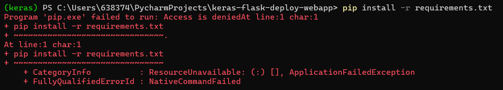
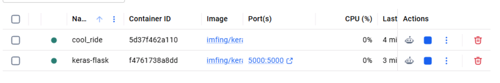
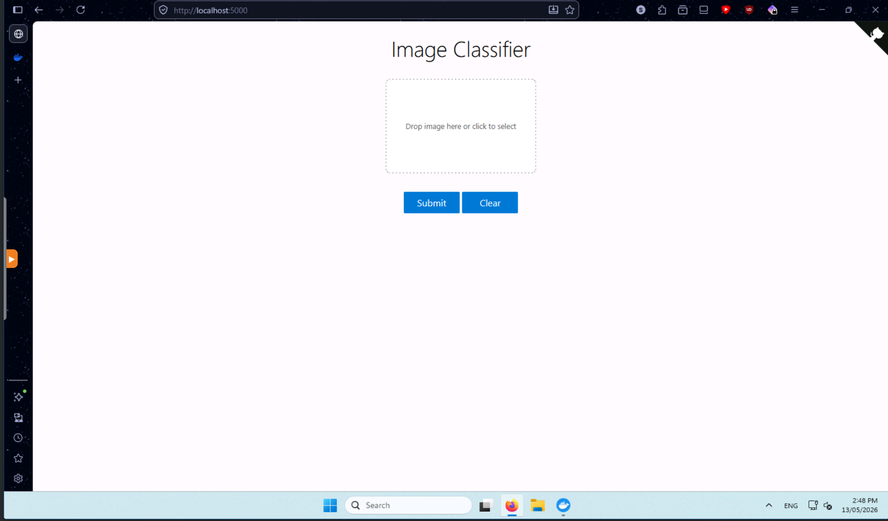

1. Start by downloading and cloning keras-flask-deploy-webapp
2. Create a venv

Unfortunately inside the venv, windows defender would flag dependencies -> had to install it outside venv

So...

We switch to running it on docker, as docker is more reliable and consitent across deployments.

Take the quickstart script 
'docker run --rm -p 5000:5000 ghcr.io/imfing/keras-flask-deploy-webapp:latest'
Pull the image and run the image -> it installs dependencies automaticallly :) (magic of docker)

It spins up 2 containers:

Indicators for the Flask app:
1. Many stars (green)
2. Outdated dependencies, that fail to install and run the app (red)
3. Proper documentation and README (green)

Indicators for the Bread app:
1. Low star count (red)
2. Readable and clearly worded README (green)
3. Relatively up to date dependencies (dependabot) (green)

Interesting AI related project (bonus):
https://github.com/MemTensor/MemOS
Tried installing MemOS about ~1.5 months ago, but unfortunately it did not work...
and instead it crashed my entire stack, and i had to forcefully remove it...

It should theoretically offer better retrieval than the OC vector db system, but given that it is so complicated and convulted
i decided it was not worth it to continue setting it up because vector db was doing alright for me.

Im pretty sure its use case is primarly memory syncronosation across different users/sessions therefore making them allow to communicate and reatin memor
across different oc instances
